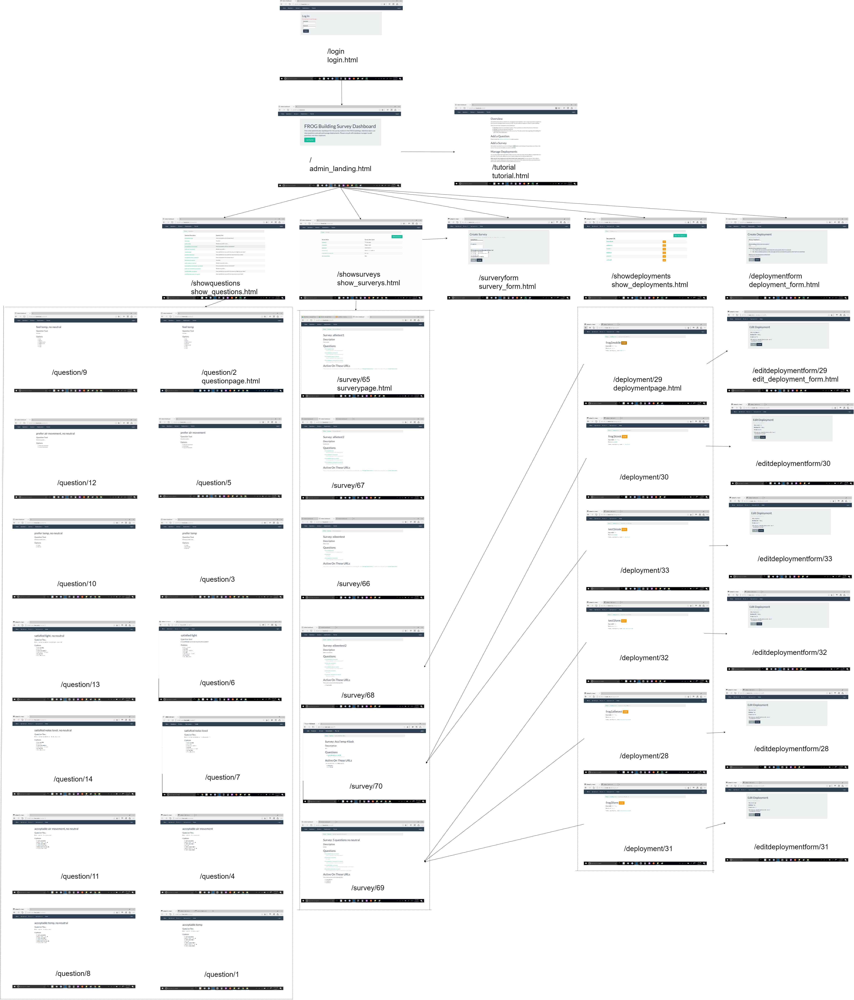

# Survey Admin
Survey Admin is a minimal flask application used to provide an user interface to create surveys for the Kiosk project.  Users can use this dashboard to group questions to form a survey and then deploy these surveys to a URL to be displayed on a kiosk.

## Screen Flow Diagram



## Installation

Clone the Github repository and follow the instructions on the [wiki](https://github.com/erdl/survey_admin/wiki/Deploy-Locally).

```
git clone https://github.com/erdl/survey_admin.git
```

## Usage

Survey Admin provides a GUI interface to adding questions and surveys for our Kiosk project.

## Documentation

Please see the [wiki](https://github.com/erdl/survey_admin/wiki) for the project documentation.

## Known Issues

Please see [Issues](https://github.com/erdl/survey_admin/issues) for known bugs and new feature requests.

## Contributing

A CONTRIBUTING.md will be updated soon. Currently, the project is maintained by ERDL. Feel free to open an issue if you are interested in contributing.

## License

Please feel free to use this project code. Code dependencies are still being assessed to decide on a license.